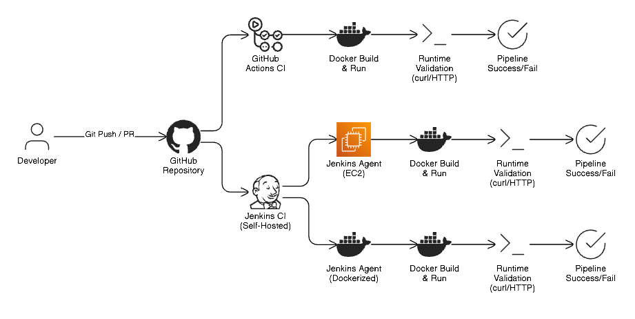

# Architecture

The architecture follows a modular CI execution model:

Developer Push  
→ GitHub Repository  
→ CI Trigger (GitHub Actions / Jenkins)  
→ Docker Build  
→ Container Execution  
→ Runtime Validation  
→ Cleanup  

Jenkins is executed in two modes:
- Cloud-based (AWS EC2)
- Local (Dockerized Jenkins with Docker socket access)

---
